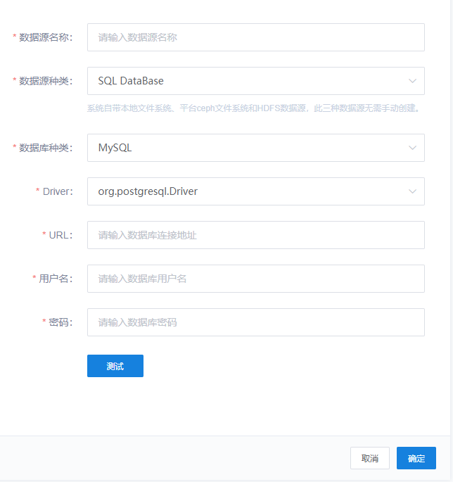

## SkyForm

### Getting Start

SkyForm致力于快速开发表单页面，使用配置的方式开发表单，减少代码量，表单结构一目了然。

一个常用的表单如图所示：



SkyForm对表单描述如下：
```javascript
new SkyFormMain({
                list: [
                    new SkyFormItem({
                        label: '数据源名称：',
                        prop: 'name',
                        value: '',
                        inputType: 'INPUT',
                        placeholder: '请输入数据源名称',
                        validator: [
                            new Validator({ required: true, message: '请输入数据源名称', trigger: 'blur' }),
                            new Validator({ pattern: /^[a-zA-Z_][a-zA-Z_0-9]{3,20}$/, message: '请输入4到20位，字母开头，数字、字母、下划线、点组成的字符串', trigger: 'blur' }, false)
                        ]
                    }),
                    new SkyFormItem({
                        label: '数据源种类：',
                        prop: 'sourceType',
                        value: 'SQL_DATABASE',
                        inputType: 'SELECT',
                        placeholder: '请选择数据源种类',
                        validator: [
                            new Validator({ required: true, message: '请选择数据源种类', trigger: 'change' }, false)
                        ],
                        options: SOURCE_TYPES_OPTION,
                        tooltip: '系统自带本地文件系统、平台ceph文件系统和HDFS数据源，此三种数据源无需手动创建。',
                        tooltipVisible: true
                    }),
                    new SkyFormItem({
                        label: '数据库种类：',
                        prop: 'databaseType',
                        value: SQL_SERVER_OPTION[0].value,
                        inputType: 'SELECT',
                        placeholder: '请选择数据库种类',
                        validator: [
                            new Validator({ required: true, message: '请选择数据库种类', trigger: 'change' }, false)
                        ],
                        options: SQL_SERVER_OPTION,
                        hide(model: Object): boolean {
                            return model.sourceType !== 'SQL_DATABASE';
                        }
                    }),
                    new SkyFormItem({
                        label: 'Driver：',
                        prop: 'driver',
                        value: SQL_DATABASE_DRIVER_OPTION[0].value,
                        inputType: 'SELECT',
                        placeholder: '请选择数据库驱动',
                        validator: [
                            new Validator({ required: true, message: '请选择数据库驱动', trigger: 'change' }, false)
                        ],
                        options: SQL_DATABASE_DRIVER_OPTION,
                        hide(model: Object) {
                            return model.sourceType !== 'SQL_DATABASE';
                        }
                    }),
                    new SkyFormItem({
                        label: 'URL：',
                        prop: 'url',
                        value: '',
                        inputType: 'INPUT',
                        placeholder: '请输入数据库连接地址',
                        validator: [
                            new Validator({ required: true, message: '请输入数据库连接地址', trigger: 'blur' })
                        ],
                        hide(model: Object) {
                            return model.sourceType !== 'SQL_DATABASE';
                        }
                    }),
                    new SkyFormItem({
                        label: '用户名：',
                        prop: 'username',
                        value: '',
                        inputType: 'INPUT',
                        placeholder: '请输入数据库用户名',
                        validator: [
                            new Validator({ required: true, message: '请输入数据库用户名', trigger: 'blur' })
                        ],
                        hide(model: Object) {
                            return model.sourceType !== 'SQL_DATABASE';
                        }
                    }),
                    new SkyFormItem({
                        label: '密码：',
                        prop: 'password',
                        value: '',
                        inputType: 'PASSWORD',
                        placeholder: '请输入数据库密码',
                        validator: [
                            new Validator({ required: true, message: '请输入数据库密码', trigger: 'blur' }, false)
                        ],
                        hide(model: Object) {
                            return model.sourceType !== 'SQL_DATABASE';
                        }
                    }),
                    new SkyFormItem({
                        label: '',
                        prop: 'dbtest',
                        value: '',
                        // eslint-disable-next-line
                        vNode(h) {
                            let attr = { onAccess: self.onAccess };
                            return (
                                <database-access-test {...{ attrs: { ...attr } }} />
                            )
                        },
                        hide(model: Object) {
                            return model.sourceType !== 'SQL_DATABASE';
                        }
                    })
                ],
                labelWidth: '120px',
                readonly: false,
                appendFooter: true
            })
```

如此我们便可以绘制上面的表单，无需写html代码。

### 表单

#### 配置说明
```flow js
// @flow

type SkyFormCfg = {
    list: Array<SkyFormItem>,
    readonly?: boolean,
    labelWidth?: string | number,
    inline?: boolean,
    labelPosition?: 'top' | 'left' | 'right',
    appendFooter?: boolean
};
```

| 属性 | 类型 | 说明 | 示例 |
| ------| ------ | ------| ------|
| **list** | Array<SkyFormItem> | 表单项描述列表 | [new SkyFormItem({...})] |
| **readonly** | Boolean | 表单是否为只读模式 | 默认值：false |
| **labelWidth** | String或Number | 表单项标签宽度 | 默认值："100px" |
| **labelPosition** | 可选值：top,left，right | 表单项标签对齐方式 | 默认值："right",右对齐 |
| **inline** | Boolean | 是否以行内方式展示 | 默认值：false |
| **appendFooter** | Boolean | 是否使用SkyForm自定义的表单提交/重置/取消工具栏 | 默认值：false | 

#### 方法

| 方法名 | 参数说明 | 说明 | 返回值 |
| ------| ------ | ------| ------|
| **push** | skyFormItem:SkyFormItem,表单项对象 | 用于向SkyForm尾部动态追加表单项 | void |
| **pop** | 无 | 删除SkyForm尾部表单项 | 返回被删除的表单项（SkyFormItem） |
| **insertAtIndex** | (item: SkyFormItem, index: Number) | 在指定下标位置插入表单项 | void |
| **removeAtIndex** | (index: Number)  | 删除指定下标的表单项 | void |
| **setValueByProp** | (prop: string, value: any) | 改变指定属性的表单项的value值 | void |
| **setModel** | model: prop与value的键值对 | 对表单项设置value值，即修改Model。使用场景：在异步获取表单初始值后，可使用该方法进行填充 | void | 

### 表单项

#### 配置说明

```flow js
// @flow

class SkyFormItem{
    prop: string; // 在model中的属性，对应ElFormItem中的prop
    label: string | (model: Object) => string; // 显示的标签，对应ElFormItem中的label
    value: any; // 属性对应的值，对应ElFormItem中的value
    // 输入类型，设置后如无vNode函数，即使用组件默认的组件渲染，目前支持的默认输入类型请查看InputWidgets下SkyFormWidgetInputTypeMap配置
    inputType: inputTypeEnum | (model: Object) => inputTypeEnum = 'INPUT';
    editable: boolean = true; // 是否支持编辑，为false时为只读模式
    validator: Array<Object> = []; // 校验函数，对应ElForm中的rules配置
    options: Array<Option> | string | Promise<any> = []; // SELECT类型的选项，支持传接口地址或label,value键值对的对象
    placeholder: string = ''; // 占位文字
    vNode: Function = (h: any, model: Object) => undefined; // 自定义渲染函数，可以使用jsx自定义输入方式或其他内容
    widgetParams: Object | (model) => Object = {}; // 使用系统默认的组件传参，一些组件比较复杂，可以通过该参数传参
    renderIgnore: boolean = false; // 是否忽略对该属性的表单渲染，适用于直接使用slot的场景，主要用于同步model以实现表单校验,不推荐使用slot场景，仅在一些特别复杂的场景使用
    hide: boolean | (model: Object, prop: string) => boolean = false; // 是否隐藏，用于有条件地控制某个表单项显示或隐藏，默认不隐藏
    tooltip: string = ''; // 表单项提示
    tooltipVisible: boolean | (model: Object, prop: string) => boolean = false; // 控制表单项提示是否显示
}
```

### 表单组件

#### Props

```javascript
props: {
        list: {
            default() {
                return [];
            },
            type: Array,
            required: true
        },
        readonly: {
            type: Boolean,
            default: false
        },
        inline: {
            type: Boolean,
            default: false
        },
        labelWidth: {
            type: String,
            default: '100px'
        },
        labelPosition: {
            type: String,
            default: 'right'
        },
        appendFooter: {
            type: Boolean,
            default: false
        },
        onConfirm: {
            type: Function,
            default() {
                return () => undefined;
            }
        },
        onCancel: {
            type: Function,
            default: undefined
        },
        onReset: {
            type: Function,
            default: undefined
        }
    },
```
#### Methods

| 方法名 | 参数说明 | 说明 | 返回值 |
| ------| ------ | ------| ------|
| getSkyForm | 无 | 获取原生ElForm组件对象 | ElForm组件对象 |
| getModel | 无 | 获取ElForm模型对象 | ElForm组件模型（Model: Object），prop-value键值对 |
| validate | 无 | 对SkyForm进行校验，会过滤掉未渲染（renderIgnore）或隐藏（hide）的表单项 | Promise |
| validateFields | (props: Array<string> | string) | 对表单的部分属性进行校验 | Promise |

#### Event

| 事件名 | 参数说明 | 说明 |
| ------| ------ | ------|
| model-change | （model: Object），当前表单的模型，prop-value键值对 | 表单的模型改变时，会触发该事件 |

#### Slot
| 名称 | 说明 |
| ------| ------ |
| form-items | 可用于向SkyForm内添加自定义的表单项，同时需要在SkyForm的list中声明该表单项对象。但重置时其model需要自行维护 |
| - | 用于向表单底部追加自定义内容 |
